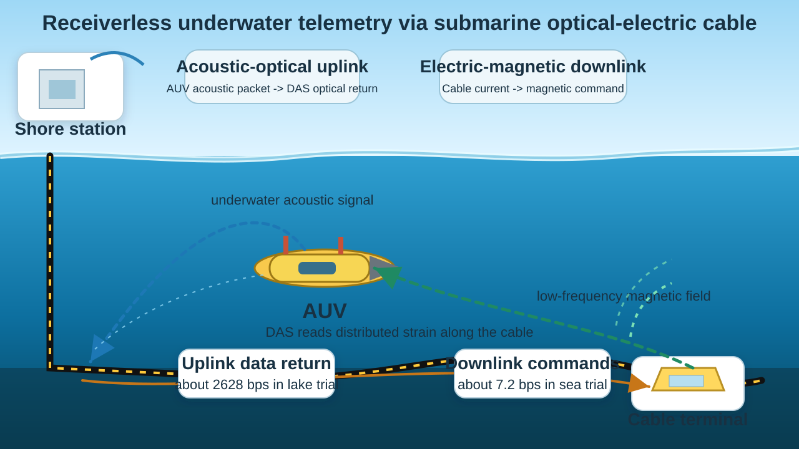

**Language:** English | [中文](/zh/post/das-underwater-communications/)

*Figure. Cable-assisted AUV telemetry framework, redrawn from the system concept in Chapter 5 of my doctoral dissertation.*

Underwater communication is usually introduced through familiar technical limits: bandwidth is narrow, sound propagation is slow, multipath is messy, and Doppler spread is hard to tame. My doctoral dissertation started from an even more basic difficulty: sometimes the receiver is simply not there.

An autonomous underwater vehicle can spend hours or days collecting valuable data during ecological surveys, environmental monitoring, deep-sea exploration, or subsea infrastructure inspection. But the data only becomes useful if it can get back to shore in time. In remote oceans, deep water, polar regions, and surface-restricted missions, a relay buoy, a ship, a seabed hydrophone, or a fixed cabled station may be too expensive, too visible, too fragile, or unavailable.

That is the problem behind the word "receiverless" in my dissertation. It does not mean communication without physics. It means communication when the usual receiving infrastructure cannot be assumed.

My PhD dissertation, *Research on Underwater Acoustic Communications Based on Unconventional Receivers for Data Backhaul*, explored two ways to create a receiving path from things that were not originally designed as underwater acoustic receivers:

1. An airborne microphone on an unmanned aerial vehicle, listening after an underwater acoustic signal crosses the water-air interface.
2. A submarine optical-electric cable, interrogated by distributed acoustic sensing (DAS), acting as a long distributed acoustic receiver.

This post focuses on the second route. It connects directly to my 2021 paper, [*Channel Distribution and Noise Characteristics of Distributed Acoustic Sensing Underwater Communications*](https://doi.org/10.1109/JSEN.2021.3115581), and to the later cable-assisted communication framework in my dissertation.

## Turning a cable into a receiver

The idea is simple to state: let the cable listen.

A DAS system sends coherent optical pulses into an optical fiber and measures phase changes in the Rayleigh backscatter. When an external acoustic wave shakes the cable, it creates tiny strain variations along the fiber. Those variations appear in the optical return. In effect, a long fiber can become a dense line of sensing channels.

This is attractive because submarine cables already cross large ocean regions. Many optical-electric cables also include fibers that can be accessed from shore. If a DAS interrogator is connected to such a fiber, the cable can become a passive acoustic receiving array without deploying a separate hydrophone on the seabed.

But there is a catch. A DAS cable does not hear the ocean the way a hydrophone does. A hydrophone records pressure at a point. A cable-based DAS receiver records strain over fiber sections after the signal has passed through water, sediment, cable structure, and optical sensing hardware. Chapter 4 of my dissertation therefore treated the received signal as a cascade:

- acoustic propagation in water,
- coupling through the seafloor or cable environment,
- mechanical response of the cable,
- conversion from cable strain to optical phase variation.

That cascade is the reason the channel study matters. Before designing a modem around a submarine cable, we need to know what the cable actually hears.

## What the 2021 experiment showed

The field experiment used a lightweight protected armored optical-electric cable in Mulan Lake. A transducer was suspended from a boat about 2 m below the surface. The cable lay on the lakebed and was connected to a shore-based DAS device. We transmitted several acoustic waveforms, including LFM, BASK, MFSK, QPSK, and OFDM signals, at distances from 1 m to 1000 m.

Three observations from that work continued to shape my later research.

First, the DAS channel did not follow the simplest textbook assumptions. The envelope amplitudes of the measured impulse responses were better fitted by a Burr distribution than by Rayleigh or normal distributions. The source position also mattered: when the transmitter moved closer to the region above the cable, the received energy became more concentrated.

Second, neighboring cable sections were not independent clean channels. Vibration could couple along the cable, so a signal recorded at one section could include contributions from nearby sections. This produced additional arrivals and affected the effective delay spread. In QPSK measurements, the estimated maximum delays were about 9.9 to 13.8 ms, with roughly 12 to 14 effective taps.

Third, the background noise was not just ordinary ocean noise. Below 1 kHz, the DAS noise power spectral density decreased at about 18 dB per octave, mainly shaped by the equipment and cable system rather than only by shipping or wind. The noise also fluctuated across time, frequency, and sensing channel. A receiver designed for a hydrophone noise model would miss part of the problem.

The important conclusion was not that the cable behaves like an ideal hydrophone. It does not. The useful conclusion was that the cable still carries recoverable communication information, as long as the receiver is designed for the channel it actually observes.

## From channel study to communication loop

Chapter 5 of my dissertation asked the next question: if a submarine optical-electric cable can receive data from an AUV, can it also help complete a two-way communication loop?

For the uplink, the answer was acoustic-to-optical. The AUV transmits an acoustic packet; the cable senses the vibration through DAS; the shore station demodulates the signal from the optical return. In a lake-trial uplink system, a QPSK signal at a 5 kHz carrier occupied about 3660 Hz of bandwidth and achieved an effective packet data rate of about 2628 bps. The DAS signal had much lower SNR than a nearby hydrophone, but it was still usable.

For the downlink, the dissertation introduced a complementary magnetic route. A shore station injects a modulated low-frequency current into the copper conductor of an optical-electric cable. The current creates a magnetic field near the cable. A high-sensitivity NV-center diamond magnetometer carried by the underwater platform can detect the field and recover low-rate commands. In the sea trial, an MFSK downlink used 16 tones from 27 Hz to 477 Hz with a symbol duration of 0.5 s, achieving about 7.2 bps.

The two links are asymmetric, but they fit the mission:

- acoustic-optical uplink for returning data from AUV to shore,
- electric-magnetic downlink for sending commands from shore to AUV.

This is the broader architecture behind the framework diagram. A submarine cable is no longer only a data pipe. It can also act as a distributed acoustic receiver, a magnetic transmitter, and a physical reference line for underwater systems.

## Why this still feels important

The 2021 DAS channel paper did not solve the entire telemetry problem by itself. Its value was more foundational: it clarified what a cable-based receiver hears, how different that observation is from a hydrophone recording, and what kind of channel and noise structure a modem must face.

The later dissertation work built on that foundation and moved from "Can the cable hear an acoustic signal?" to "Can the cable help an AUV return data when ordinary receiving infrastructure is missing?"

For me, that shift is the exciting part. Instead of asking only how to deploy more receivers in the ocean, we can ask a more flexible question:

What existing infrastructure can already receive something useful, if we learn how to listen?

## Sources and related pages

- Paper DOI: <https://doi.org/10.1109/JSEN.2021.3115581>
- PhD dissertation source: Chapters 1, 4, and 5 of my doctoral thesis
- Google Scholar profile: <https://scholar.google.com/citations?hl=en&user=KvxU4p4AAAAJ>
- ResearchGate profile: <https://www.researchgate.net/profile/Shaojian-Yang>
